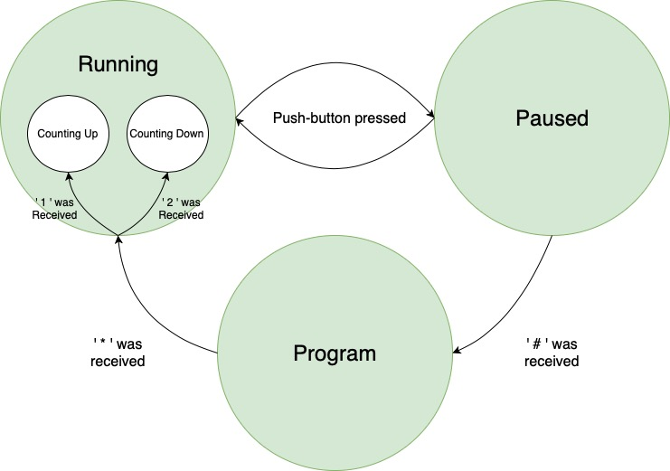

# What

We built an IR remote and timer as our final design project for an embedded systems course (ECE 312). 

# How 

Ignoring the hardware setup for now, the project involved programming two AtMega328p microcontrollers; one to handle the inputs from a 3x4 keypad and emit it and the other to process that data to program a timer. 

### Remote Control Unit

The GPIO pins of the MCU connected to the 3 columns and 4 rows of the keypad were constantly read to check if a key was pressed. If a key was pressed, it's value was transmitted via UART. The character representing the pressed key was outputted through the TX pin of the MCU which was connected an IR LED.

### Timer Unit  

The timer unit required a second MCU to be programmed that would listen for data over UART (i.e constantly read RX pin), convert the data sent over to correct time format, and start incrementing or decrementing time depending on user setting and lastly, displaying it on the LCD screen. The counting up/down of time was done by configuring the MCU's 16-bit timer/counter module to generate an interrupt every 100us.  

A state machine was impemented consisting of the following states;

1. Running State: not listening for data, and interrupts are enabled (i.e time is being incremented/decremented every 100us)
2. Paused State: interrupts disabled, listening for '#' key
3. Program State: interrupts disabled, listening for time input values, converting input values to correct format.

## Acknowledgments

This project was built alongside with Andrew Schoen. 